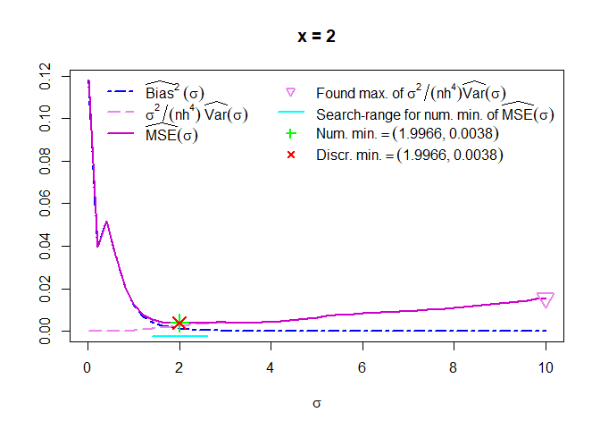

<!-- README.md is generated from README.Rmd. Please edit that file -->
kader
=====

The goal of kader is to supply functions to compute nonparametric kernel estimators for

-   density estimation using a data-adjusted kernel or an appropriate rank-transformation, and for
-   regression using a data-adjusted kernel.

The functions are based on the theory introduced in

-   Srihera, R., Stute, W. (2011): Kernel adjusted density estimation. Statistics and Probability Letters 81, 571 - 579, URL <http://dx.doi.org/10.1016/j.spl.2011.01.013>.
-   Eichner, G., Stute, W. (2012): Kernel adjusted nonparametric regression. Journal of Statistical Planning and Inference 142, 2537 - 2544, URL <http://dx.doi.org/10.1016/j.jspi.2012.03.011>.
-   Eichner, G., Stute, W. (2013): Rank Transformations in Kernel Density Estimation. Journal of Nonparametric Statistics 25(2), 427 - 445, URL <http://dx.doi.org/10.1080/10485252.2012.760737>.

A very brief summary of the theory and sort of a vignette is presented in Eichner, G. (2017): Kader - An R package for nonparametric kernel adjusted density estimation and regression. In: Ferger, D., et al. (eds.): From Statistics to Mathematical Finance, Festschrift in Honour of Winfried Stute. Springer International Publishing. To appear in Oct. 2017.

Installation
------------

You can install kader from github with:

``` r
# install.packages("devtools")
devtools::install_github("GerritEichner/kader")
```

Example
-------

This is an example which shows you how to solve a common problem:

``` r
library(kader)
 # Generating N(0,1)-data
set.seed(2017);     n <- 100;     d <- rnorm(n)

 # Estimating f(x0) for one sigma-value
x0 <- 1
fit <- kade(x = x0, data = d, method = "nonrobust", Sigma = 1)
#> h set to n^(-1/5) with n = 100.
#> theta set to arithmetic mean of data in d.
#> Using the adaptive method of Srihera & Stute (2011).
print(fit)
#> 
#> Call:
#>  fnhat_SS2011(x = x, data = data, K = Kadap, h = h, theta = theta,     sigma = Sigma)
#> 
#> Data: data (100 obs.);   Bandwidth 'bw' = 0.3981
#> 
#>        x           y         
#>  Min.   :1   Min.   :0.2125  
#>  1st Qu.:1   1st Qu.:0.2125  
#>  Median :1   Median :0.2125  
#>  Mean   :1   Mean   :0.2125  
#>  3rd Qu.:1   3rd Qu.:0.2125  
#>  Max.   :1   Max.   :0.2125

 # Estimating f(x0) for sigma-grid
x0 <- 1
fit <- kade(x = x0, data = d, method = "nonrobust",
  Sigma = seq(0.01, 10, length = 10), ticker = TRUE)
#> h set to n^(-1/5) with n = 100.
#> theta set to arithmetic mean of data in d.
#> Using the adaptive method of Srihera & Stute (2011).
#> 
#> For each element in x: Computing estimated values of
#> bias and scaled variance on the sigma-grid.
#> Note: x has 1 element(s) and the sigma-grid 10.
#> 
#> As a little distraction, the 'ticker' documents the
#> computational progress (if you have set ticker = TRUE).
#> x[1]:sigma:1,2,3,4,5,6,7,8,9,10.
#> Minimizing MSEHat:
#> Step 1: Search smallest maximizer of VarHat.scaled on sigma-grid.
#> Step 2: Search smallest minimizer of MSEHat on sigma-grid to the
#>         LEFT of just found smallest maximizer of VarHat.scaled.
#> Step 3: Finer search for 'true' minimum of MSEHat using
#>         numerical minimization. (May take a while.)
#> sigma:1.sigma:1.sigma:1.sigma:1.sigma:1.sigma:1.sigma:1.sigma:1.sigma:1.sigma:1.sigma:1.sigma:1.sigma:1.sigma:1.sigma:1.sigma:1.
#> Step 4: Check if numerically determined minimum is smaller
#>         than discrete one.
#>         Yes, optimize() was 'better' than grid search.
print(fit)
#>   x         y sigma.adap   msehat.min discr.min.smaller sig.range.adj
#> 1 1 0.2070522  0.4685886 0.0006656016             FALSE             0

 # Estimating f(x0) for sigma-grid and Old-Faithful-eruptions-data
x0 <- 2
fit <- kade(x = x0, data = faithful$eruptions, method = "nonrobust",
  Sigma = seq(0.01, 10, length = 51), ticker = TRUE, plot = TRUE)
#> h set to n^(-1/5) with n = 272.
#> theta set to arithmetic mean of data in faithful$eruptions.
#> Using the adaptive method of Srihera & Stute (2011).
#> 
#> For each element in x: Computing estimated values of
#> bias and scaled variance on the sigma-grid.
#> Note: x has 1 element(s) and the sigma-grid 51.
#> 
#> Please, have a little patience; this may need some time.
#> You may want to watch the 'ticker' as time goes by
#>  (if you have set ticker = TRUE).
#> x[1]:sigma:1,2,3,4,5,6,7,8,9,10,11,12,13,14,15,16,17,18,19,20,21,22,23,24,25,26,27,28,29,30,31,32,33,34,35,36,37,38,39,40,41,42,43,44,45,46,47,48,49,50,51.
#> Minimizing MSEHat:
#> Step 1: Search smallest maximizer of VarHat.scaled on sigma-grid.
#> Step 2: Search smallest minimizer of MSEHat on sigma-grid to the
#>         LEFT of just found smallest maximizer of VarHat.scaled.
#> Step 3: Finer search for 'true' minimum of MSEHat using
#>         numerical minimization. (May take a while.)
#> sigma:1.sigma:1.sigma:1.sigma:1.sigma:1.sigma:1.sigma:1.sigma:1.sigma:1.sigma:1.sigma:1.sigma:1.sigma:1.
#> Step 4: Check if numerically determined minimum is smaller
#>         than discrete one.
#>         Yes, optimize() was 'better' than grid search.
```



``` r
print(fit)
#>   x         y sigma.adap  msehat.min discr.min.smaller sig.range.adj
#> 1 2 0.5478801   1.996644 0.003822793             FALSE             0
```
